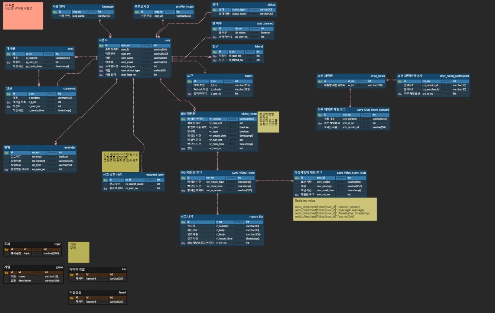

# 토크토피아: 실시간 번역 랜덤 채팅 프로젝트
> **SSAFY 9기 공통프로젝트 - 실시간 번역 기능을 탑재한 랜덤 화상 채팅 웹 <br>
개발 기간 : 23.07.10~23.08.18**

## 배포 주소
> 개발 버전 : url<br>
프론트 서버 : url<br>
백엔드 서버 : url

## 팀 소개
### 구성원
- **팀장: 우수인 - @wbo1026**
- 팀원: 
  - 김나연 - @nayeon0016
  - 김준석 - @pepaa15
  - 정재욱 - @wodnr8462
  - 이진서 - @lalaququ

### 구성원 프로필
...

## 프로젝트 소개

**본 프로젝트는 사용자에게 실시간 번역 및 자막 송출 기능을 통해 언어의 장벽을 넘어서 교육에 이르는 경험을 제공합니다.**

**토크토피아**는 크게 다음과 같은 기능을 지원합니다
1. 랜덤 화상 채팅
2. 친구와 화상 채팅

## 시작 가이드
### 요구사항
버전에 맞는 환경이 필요합니다.

FE
- React 18.2.0
- Node.js 18.16.1
- TypeScript
- React-Redux 8.1.1
- CSS3 or styled-components
- Figma

BE
- Jdk 11
- SpringBoot 2.7.1


### 설치
```
$ git clone [url]
$ cd [프로젝트 주소]
```

#### 백엔드
```
$ cd [백엔드 프로젝트 주소]
$ mvn spring-boot:run
```

#### 프론트엔드
```
$ cd [프론트엔드 프로젝트 주소]
$ npm install
$ npm run start
```
## 사용 기술
### Environment
    

### Config


### Development
#### - Back-End


#### - Front-End


  

### 외부 API


### Management


### Communication


### Deploy


## 화면 구성

## 주요 기능
### 랜덤 화상 채팅
각국의 사용자와 화상 채팅을 즐겨보세요. 실시간 번역 기능을 통해 언어의 어려움을 해소해 드립니다. <br>
**주제 랜덤 선정 기능**과 **게임 기능**을 이용해 다른 유저와 더 친밀해지세요!
<br><br>
**주제 랜덤 선정 기능**을 이용하면 매칭된 상대와 대화할 주제를 선정해 줍니다.<br>
대화 주제를 고민하는 시간을 줄이고 상대방의 관심사를 빠르게 확인할 수 있습니다.
<br><br>
또한 **게임**에 참여하여 각국의 사용자들과 문화, 언어의 차이를 해소하고 재미있는 시간을 보내세요.


### 친구와 화상 채팅
랜덤 화상 채팅에서 친해진 상대와 친구를 맺어 따로 화상 채팅할 수 있습니다.<br>


## 아키텍쳐

### ERD



